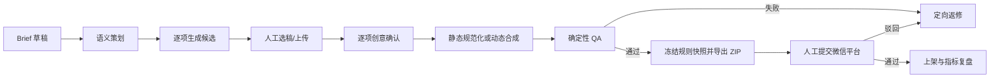
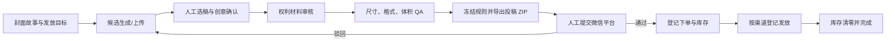
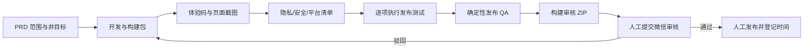
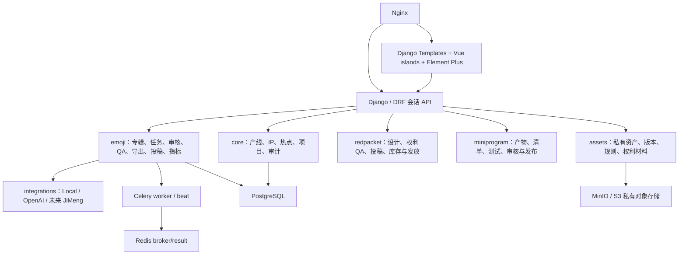

# 微信生态产品流水线：业务与技术架构

## 1. 产品定位

系统是内部自营的微信生态内容工厂，不是面向外部创作者的 SaaS。核心目标是把“选题—创意—生成—人工判断—平台检查—投稿—复盘”沉淀为可追踪、可复用、可并行的生产过程。

三条产品线共享项目、IP、热点、资产、规则、任务、审核、审计与指标底座：

| 产品线 | 当前状态 | 独有阶段 |
|---|---|---|
| 表情包 | 已启用 | 语义矩阵、候选选稿、静态/序列帧处理、表情平台 QA、投稿包 |
| 红包封面 | 已启用 | 封面故事、候选选稿、权利与技术 QA、投稿、下单、库存、发放 |
| 小程序 | 已启用 | PRD、构建、隐私合规、体验版、测试用例、审核包、微信审核、发布 |

`ProductLine.adapter_path` 是产线扩展点。每条产线实现适配器并注册自身阶段、规则和操作，不复制账户、资产或审计模块。

## 2. 业务入口

### 原创 IP 线

1. 建立 `IPCharacter`。
2. 锁定一个 `IPCharacterVersion`：角色性格、造型锚点、色板、禁用元素、参考说明。
3. 项目绑定角色版本，后续即使 IP 升级，历史作品仍可复现。
4. 正式投稿前为参考图和权利文件登记 `RightsEvidence`。

### 热点快线

1. `TrendTopic` 保存来源 URL、来源快照、观察时间、过期时间和风险级别。
2. 项目可以选择纯热点或 IP × 热点。
3. 到期热点会被定时任务暂停；QA 也会阻断使用已过期热点的投稿包。
4. 热点只影响创意输入，不绕过权利与平台规则检查。

## 3. 表情包主链路

专辑状态：

`draft → brief_approved → generating → creative_review → processing → qa_review → export_ready → submitted → published`

任何平台驳回进入 `rework`，返修不会删除旧资产、旧任务或旧导出。每次合法状态变化写入 `TransitionEvent`。

### 静态表情

- AI 或上传文件先登记原始资产。
- 表情包有独立工作区；项目与选题继续保存 IP、热点和权利上下文。
- 基础、风格、构图、质量和负向提示词按可复用片段管理，新专辑自动应用各分类默认项。
- 每个表情保留独立提示词，可人工编辑，也可交给 Qwen 或 OpenAI 优化；生成任务冻结当次组合快照。
- 规范化处理生成独立 `final_static` 版本：透明 PNG、240×240、等比缩放。
- 候选与选中版本分离，再生成不会覆盖人工确认版本。

### 动态表情

- 当前实现是可靠的序列帧路线：从选中母图生成 2–12 帧。
- 每帧是独立资产，可在时间轴上调顺序和 40–2000ms 停留时间。
- 保存时间轴只重新合成 GIF，不重新生成或覆盖母帧。
- 合成器执行调色板压缩，并记录帧数、总时长、尺寸和校验和。
- 即梦后续作为新的 `AIProvider` 或异步视频提供商接入，先输出帧资产，再复用现有时间轴、QA 与导出链路。

## 4. 人工与自动化边界

AI 负责：

- 聊天语义矩阵与提示词草案
- 使用 `qwen3.7-plus` 或 OpenAI 优化文本提示词
- 图像候选
- 静态母图到轻量序列帧的演示生成

人工负责：

- Brief 确认、候选选择、创意通过
- IP 一致性、冒犯性、热点风险和权利判断
- 微信平台实际提交、驳回原因登记和最终上架确认

自动 QA 只做可确定判断：目标数量、是否选稿、格式、像素、字节数、帧数、支持素材、热点有效期和权利材料提示。它不把主观创意评分伪装成确定性结论。

`qwen3.7-plus` 只输出文本，因此不能直接承担图像生成。策划模型与生图模型在制作台中分开选择，避免把视觉理解能力误当作图片输出能力。

## 5. 红包封面主链路

每次重新选稿会让旧预览失效并生成新版本；旧候选和旧导出包不删除。平台审核通过前不能登记下单，发放数量不能超过可用库存。

## 6. 小程序发布主链路

审核包包含当前构建、体验码、截图、隐私摘要、检查清单与测试报告。构建和体验码采用“当前版本”标记，替换时保留历史资产。

## 7. 技术分层

采用模块化单体是为了让首条产线快速闭环，同时保留清楚的边界。当前业务规模不需要先承担微服务的一致性、部署和排障成本；当媒体任务需要独立扩容时，可先拆 worker 队列而不拆领域数据。

## 8. 数据可靠性

- 所有领域主键使用 UUID。
- 资产不原地覆盖；处理结果通过父版本、校验和和元数据追踪。
- `GenerationJob.idempotency_key` 防止相同输入重复创建任务。
- AI 缺密钥、提供商失败和媒体处理失败只改变当前任务状态。
- 每个导出包保存 `PlatformRuleSet` 外键和完整规则快照。
- ZIP 包包含 `manifest.json`、投稿清单、表情文件、封面/图标/横幅和权利文件目录。
- 平台投稿保持人工边界，系统记录平台作品编号、状态、驳回原因和计划发布时间。

## 9. 权限

预置角色：

- `planner`：项目、Brief、语义策划
- `creator`：生成、上传、选稿、动态时间轴
- `reviewer`：创意确认、QA、状态推进
- `operator`：导出、投稿登记、平台状态、指标
- `admin`：全量权限与后台配置

页面与 API 都要求登录，资产预览和导出下载通过 Django 鉴权，不直接公开对象存储地址。

## 10. 部署与演进

Compose 服务：

- `nginx`：静态文件与反向代理
- `web`：Gunicorn 承载 Django
- `worker`：耗时 AI/媒体任务
- `beat`：热点过期等周期任务
- `postgres`：领域数据
- `redis`：任务队列
- `minio`：私有源文件、候选、成品和导出包

后续优先顺序：

1. 用真实平台要求确认新的规则版本。
2. 接入正式 IP 参考资产和权利材料。
3. 用实际业务数据校准语义模板、生成成本和通过率指标。
4. 接入即梦动态能力，复用现有序列、审核与导出接口。
5. 用真实红包封面下单/发放数据和小程序审核反馈校准规则、成本与通过率指标。
